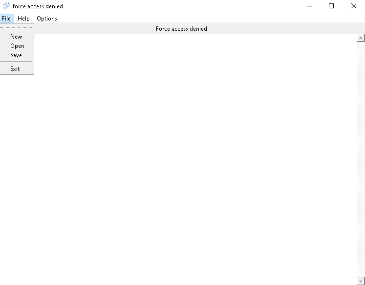

# Access-Denied bypass
Edit everything in any path.

## Requirements: 
```bash
pip install pyttsx3
```

## How to use:
You can use gui.py very simply
also you can use access.py to append some lines to a file with terminal-cmd:
'''bash
python access.py YourFilePath Mode
ex: python access.py c:/users/you/Desktop/any.txt a -> a is append and w is write.
'''

- my website: [razyar saeedian](https://khoderazyar.ir)
